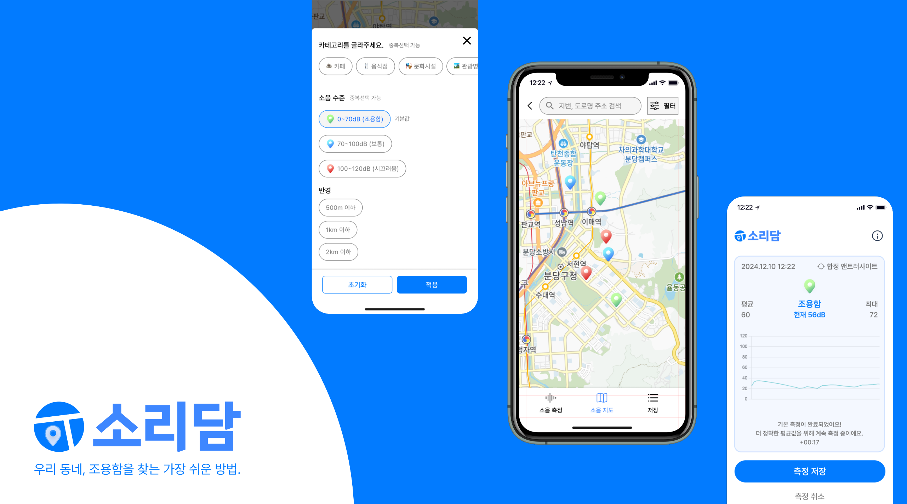

---

## 프로젝트 소개

**소리담**은 사용자가 지역 소음 데이터를 측정하고 이를 기반으로 조용한 공간을 탐색할 수 있도록 돕는 동네 기반 소음 측정 서비스입니다. 실시간 소음 측정, 데이터 시각화, 저장 및 필터링된 검색 기능을 제공하여 사용자에게 맞춤형 정보를 제공합니다.

---

## 주요 기능

### 1. 소음 측정
- 실시간 소음 데이터를 15초 평균으로 측정하고 시각화.
- 시간대별 소음 강도를 그래프로 분석 가능.
- 측정 결과를 저장하거나 공유 가능.

### 2. 소음 지도
- 지역별 소음 데이터를 지도 위에 시각적으로 표시.
- 소음 수준, 반경, 장소 유형 등을 기준으로 세분화된 검색 가능.
- 사용자가 원하는 반경(500m, 1km, 2km 이하)의 공공 공간 확인 가능.

### 3. 저장
- 소음 데이터를 저장하여 언제든 확인 가능.
- 저장된 데이터 목록 및 세부 정보를 간편히 열람.
- 장소별 소음 수준 비교 및 관리 가능.

---

## 기술 스택

- **언어 및 프레임워크:** Spring Boot, Spring JPA, QueryDSL, Spring Security
- **데이터베이스:** PostgreSQL (Command), MongoDB (Query - 적용 예정)
- **도구 및 환경:** Docker, Redis, GitHub Actions, IntelliJ IDEA, WebSocket
- **패턴 및 설계:** CQRS 패턴, 멀티 모듈 아키텍처

---

## 앞으로의 계획

1. **제품 완성 및 사용자 기반 확보**
    - 해커톤에서 개발한 프로토타입을 기반으로 MVP를 출시.
    - 사용자 테스트를 통해 피드백을 수집하고 UI/UX 개선.

2. **지속 가능성과 사회적 가치**
    - 소음 데이터를 활용해 교통 소음 관리 및 환경 문제 해결 기여.
    - 사용자와 지역 커뮤니티의 삶의 질을 향상시키는 서비스로 발전.

3. **기술적인 확장**
    - MongoDB를 활용하여 CQRS 패턴을 완전히 적용.
    - WebSocket 기반 실시간 알림 기능을 구현해 사용자 경험 강화.

---