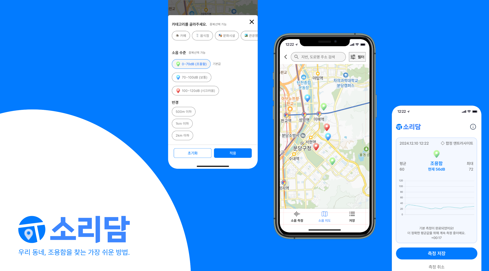
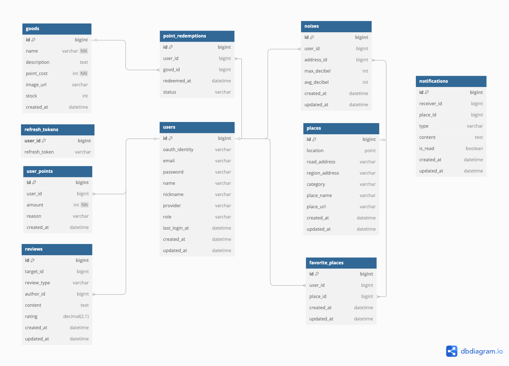

## 🗂 프로젝트 소개

> “시끄러운 공간 속에서 벗어나고 싶은 이들을 위해, 진짜 조용한 장소를 찾다.”

소리담은 사용자 참여 기반의 소음 측정 및 장소 리뷰 시스템을 통해, 혼자 있고 싶은 사람, 공부하고 싶은 사람, 조용한 대화를 나누고 싶은 사람들에게 유용한 장소 정보를 제공합니다.

---

## 🧱 기술 스택

* **Language**: Java 17
* **Framework**: Spring Boot 3
* **Database**: PostgreSQL + PostGIS (위치 기반)
* **Cache/Queue**: Redis (Streams, Cache)
* **API**: Kakao Map API
* **Security**: JWT 인증, Spring Security
* **Infra**: Docker, GitHub Actions, Swagger

---

## 🧩 아키텍처 다이어그램

> 추후 추가 예정입니다.

---

## 🗂 ERD 다이어그램

> 사용자, 장소, 소음, 리뷰, 즐겨찾기, 알림, 포인트, 상품, 교환 요청까지의 전체 관계 구조를 시각화한 ERD입니다.

---

## 🎯 주요 기능 요약

| 기능         | 설명                                          |
| ---------- | ------------------------------------------- |
| 회원가입/로그인   | 이메일 기반 또는 OAuth 연동                          |
| 토큰 기반 인증   | Access/Refresh Token 기반 JWT 인증 구현           |
| 장소 등록      | Kakao Map API + 좌표 기반 장소 등록                 |
| 소음 측정 등록   | 장소별 소음 측정 데이터 등록 (max/avg dB)               |
| 장소 검색      | 사용자 위치 반경 내 조용한 장소 검색 (거리 기반 정렬)            |
| 리뷰 등록 및 조회 | 장소에 대한 후기 작성 및 평균 평점 반영                     |
| 리뷰 요약 기능   | GPT를 활용해 장소 리뷰를 요약하고 Redis에 캐싱              |
| 즐겨찾기       | 사용자 관심 장소 즐겨찾기 추가/삭제                        |
| 알림         | 즐겨찾기 장소에 새 리뷰 등록 시 실시간 알림 (Redis Stream 기반) |
| 포인트 적립 시스템 | 소음 데이터 등록 시 포인트 지급 로그 관리                    |
| 포인트 상점     | 상품 목록 조회 및 포인트 교환 요청 처리                     |
| 관리자 승인 기능  | 상품 교환 요청에 대한 상태 변경 (PENDING → APPROVED)     |

---

## 💡 API 명세서

전체 API 명세는 아래 마크다운 형식으로 확인 가능합니다.

> 인증이 필요한 API는 `Authorization: Bearer {accessToken}` 헤더를 포함해야 합니다.

(아래는 이전에 작성한 API 섹션 그대로 유지됩니다)

---

## 🔗 Swagger 문서

👉 [📄 Swagger API 문서 보기](https://soridam-api.example.com/swagger-ui.html)

> 이 링크는 실제 배포 환경에 따라 변경될 수 있습니다. 개발 단계에서는 로컬 주소(`http://localhost:8080/swagger-ui.html`)를 참고하세요.
